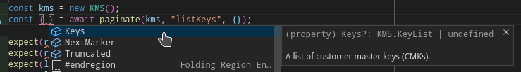
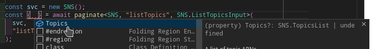
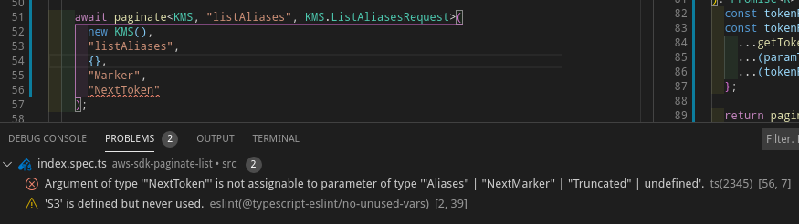

# aws-sdk-paginate-list


[](https://coveralls.io/github/jurijzahn8019/aws-sdk-paginate-list?branch=main)
[](https://app.dependabot.com/accounts/jurijzahn8019/repos/244303035)
[](LICENSE)
[](https://www.npmjs.com/package/@jurijzahn8019/aws-sdk-paginate-list)
[](https://snyk.io/test/github/jurijzahn8019/aws-sdk-paginate-list)
[](https://bundlephobia.com/result?p=@jurijzahn8019/aws-sdk-paginate-list)
[](https://github.com/jurijzahn8019/aws-sdk-paginate-list/commits/main)

## Synopsis

A function which wraps execution of pagination on aws-sdk results which
paginate their results. For example `SecretsManager.listSecrets`

## Motivation

1. implementing a pagiantion for every aws-sdk function is a pain.
1. implementing a generic function is easy, but could get messy.

This package provides the generic wrapper function and also
typings to infer the results and input args for the used pagination
function in order to simplify the usage of those.

## Features

- No Dependencies
- Typings
- Type inference on the usage

## Usage

If the conditionally types are already setup fo the service/function.
The usage is very easy:

```ts
import { KMS } from "aws-sdk";
import { paginate } from "@jurijzahn8019/aws-sdk-paginate-list";

const kms = new KMS();
const { Keys } = await paginate(kms, "listKeys");
```



But even if there are no mappings for certain types (PRs are welcome 😀)
You can supply own config and metadata

```ts
import { SNS } from "aws-sdk";
import { paginate } from "@jurijzahn8019/aws-sdk-paginate-list";

const svc = new SNS();
const { Topics } = await paginate<SNS, "listTopics", SNS.ListTopicsInput>(
  svc,
  "listTopics"
);
```



The typescript inference will help you to pass parameter in a right way



Works Great with mocks

```ts
import { paginate } from "@jurijzahn8019/aws-sdk-paginate-list";

export async function getSecrets(only?: string[]): Promise<SecretsManager.SecretListType> {
  const smn = new SecretsManager();
  const { SecretList } = await paginate(smn, "listSecrets"));
  return SecretList;
}
```

```ts
import { on } from "@jurijzahn8019/aws-promise-jest-mock";
import { SecretsManager } from "aws-sdk";

jest.mock("aws-sdk");

const listSecrets = on(SecretsManager)
  .mock("listSecrets")
  .resolve({
    SecretList: [
      { Name: "one", Tags: [{ Key: "foo", Value: "bar" }] },
      { Name: "two" },
    ],
  });

it("Should list secrets from secretsmanager", async () => {
  const res = await getSecrets();
  expect(res).toMatchSnapshot();
  expect(listSecrets.mock).toHaveBeenCalledTimes(1);
});
```

## Contribution

if you miss a function/service for better type inference,
feel free to add it to [Mappings](./src/mappings.ts) and PR it back

## Test

execute tests:

```bash
npm run test
```

## Changelog

See change history here [Changelog](CHANGELOG.md).

## License

[MIT License](https://choosealicense.com/licenses/mit/)
